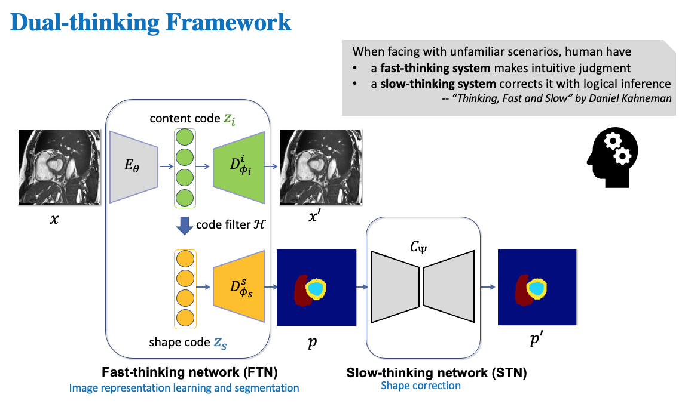
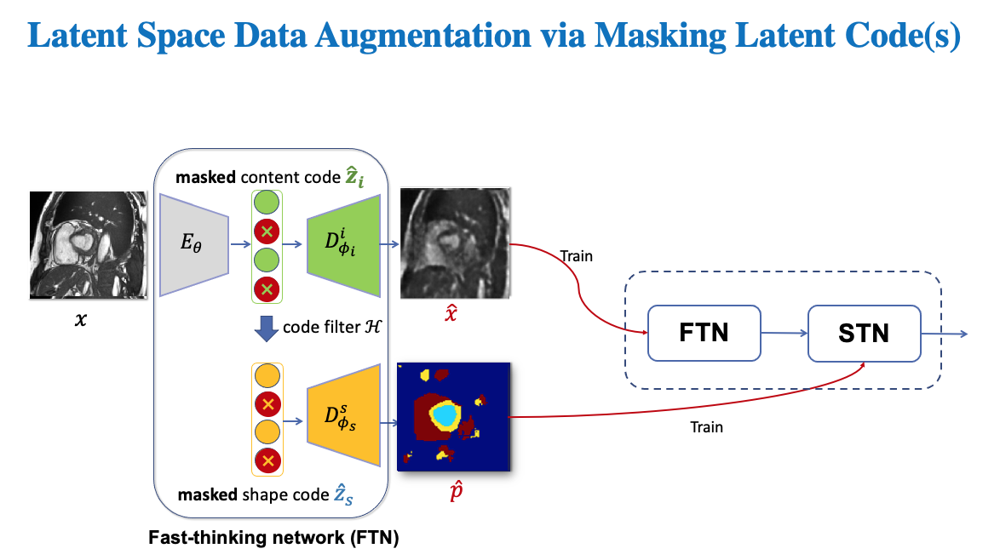
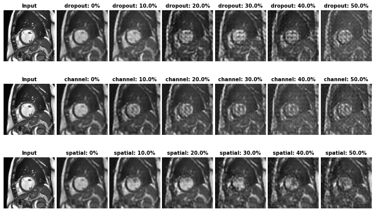
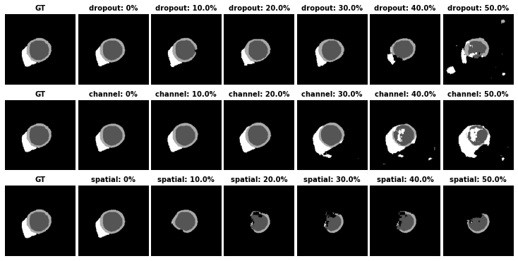

# Domain Generalized, Robust Medical Image Segmentation

This repo contains the pytorch implementation of "Cooperative Training and Latent Space Data Augmentation for Robust Medical Image Segmentation" (MICCAI 2021 Oral).
[[Video](https://www.youtube.com/watch?v=Q2ipVU-YuwQ)] [[Paper](https://arxiv.org/abs/2107.01079)] [[Poster](https://drive.google.com/file/d/1wU7bHgIyRQJM5rCVpIx89X2XBUBPv0Ug/view?usp=sharing)].

## Introduction

We propose a cooperative training framework which consists of a dual-thinking framework and a latent space data augmentation methods for single domain generalization. Unlike existing domain generalization methods, our method does not require multi-domain datasets to learn domain invariant robust features. Our network is capable of self-generating challenging images and segmentations to simulate unseen domain shifts. These hard examples are then used to reinforce the training of our dual-thinking framework for improved cross-domain performance.

### Dual thinking framework

Inspired by the two-system model in human behaviour sciences, we design a dual-thinking framework with a fast-thinking network (FTN) for intuitive judgement (image understanding and segmentation) and a slow-thinking network (STN) for shape correction and refinement.



Please see [medseg/models/advanced_triplet_recon_segmentation_model.py](medseg/models/advanced_triplet_recon_segmentation_model.py) for detailed network structures. Note, researchers are highly welcomed to adjust the inner structures of encoder and decoders to improve the performance on their datasets.

### Latent space data augmentation

We perform latent space masking on the latent image latent code and shape code to get corrupted images and corrupted segmentations, which are then used to train both FTN and STN.



In our paper, we present three ways to perform latent code masking:

- Random Dropout (channel-wise)
- Targeted channel-wise masking [medseg/models/model_util.py](medseg/models/model_util.py) (mask_latent_code_channel_wise)
- Targeted spatial-wise masking [medseg/models/model_util.py](medseg/models/model_util.py) (mask_latent_code_spatial_wise)

Unlike random masking which is image content agnostic, the targeted maskings use the gradients of task-specific losses w.r.t latent code to identify salient features in the latent space to mask. In this way, we can generate challenging samples to benefit the learning of the downstream tasks.

- Generated corrupted images:

  

- Generated corrupted segmentations:

  

We also provide a jupyter notebook to visualize hard example generation: [visualization/vis_hard_example.ipynb](visualization/vis_hard_example.ipynb).

At training time, we randomly select one type of masking schemes with random probability/threshold p to generate hard samples. Please see [medseg/models/advanced_triplet_recon_segmentation_model.py](medseg/models/advanced_triplet_recon_segmentation_model.py)(function: hard_example_generation).

For more details please see our paper on [arXiv](https://arxiv.org/abs/2107.01079).

## Set Up

- Git clone this project
- Install PyTorch and other required python libraries with:
  `pip install -r requirements.txt`
- Install torchsample for data augmentation
  `pip install git+https://github.com/ozan-oktay/torchsample/`
- Download the trained models checkpoints [link](https://drive.google.com/file/d/1UFkkndyU79Lt0u92CAqmXKzknLj2_ZgC/view?usp=sharing) and put unzipped folder: `saved/` under the project dir.

## Data

- Download Datasets:
  - [ACDC dataset](https://www.creatis.insa-lyon.fr/Challenge/acdc/databases.html) for training and intra-domain testing
  - [M&Ms dataset](https://www.ub.edu/mnms/) for cross-domain testing
  - [ACDC-C dataset](https://drive.google.com/file/d/1QEpe00AaUzrRPFCSNuOsoF7KHwYG5_oB/view?usp=sharing) for robustness test. We use [TorchIO](https://torchio.readthedocs.io/) to generate corrupted ACDC test data [sample code](medseg/dataset_loader/generate_artefacted_data.py).
- Data preprocessing[[example code](medseg/dataset_loader/acdc_preprocess.py)]:

  - Intensity normalization: image intensities are normalized to (0,1)
  - Image resampling: resample images to have a uniform pixel spacing [1.36719, 1.36719]

  * Comparison: Please note, users are encouraged to run our methods on their own machines for fair comparison instead of directly coping all numbers from the paper. We have also optimized our framework accordingly to improve the performance of baseline methods, while the core component, i.e., latent code masking remain the same for consistency. 
  * For the access of preprocessed data, please email to: chen.chen15@imperial.ac.uk. Due to data privacy issues, please provide us with the evidence that you have been granted for the use of the specific datasets, e.g. you have registered to use. Apply online: [ACDC](https://www.creatis.insa-lyon.fr/Challenge/acdc/databasesTraining.html), [MnMs](https://www.ub.edu/mnms/). We are happy to provide preprocessed data upon request under the [dataset policy](https://www.ub.edu/mnms/documents/data_use_agreement.pdf) for **research purpose** only. 

- In our experiments, ACDC and other test datasets have been reorganised as follows:
  - ACDC_root_dir
    - 001
      - ED_img.nii.gz
      - ED_seg.nii.gz
      - ES_img.nii.gz
      - ES_seg.nii.gz
    - 002
      - ED_img.nii.gz
      - ED_seg.nii.gz
      - ES_img.nii.gz
      - ES_seg.nii.gz
      ...
    - 100 
      - ED_img.nii.gz
      - ED_seg.nii.gz
      - ES_img.nii.gz
      - ES_seg.nii.gz

## Usage

- Train our networks using ACDC training set:

  ```
  CUDA_VISIBLE_DEVICES=0 python medseg/train_adv_supervised_segmentation_triplet.py --json_config_path "./config/ACDC/cooperative_training.json" --cval 0 --data_setting 10 --log --seed 40
  ```

  - json_config_path: path/to/configuration_file. You can apply cooperative training/standard training by specifying its corresponding config file path.

    - cooperative training (w/ latent space DA): [config/ACDC/cooperative_training.json](config/ACDC/cooperative_training.json)
    - standard training (w/o latent space DA): [config/ACDC/standard_training.json](config/ACDC/standard_training.json)
    - Note: Before running, please change the `root_dir` to your local path (path-to-ACDC_root_dir)

  - data_setting: int/float/str, using n (int) subjects or n% subjects for training
    - 10: use 10 training subjects (limited training set)
    - `standard`: 70 training subjects (large training set). training/val/testing:70/10/20. See [medseg/dataset_loader/ACDC_few_shot_cv_settings.py](medseg/dataset_loader/ACDC_few_shot_cv_settings.py) for reference.
  - cval: int, seed for specifying a particular random set of training subjects for multiple runs. default:0.
  - seed: int, randomness control.
  - log: boolean, for visualizing the training/val curves.
    - If set to true, Please open another terminal and run `tensorboard --logdir ./saved/ --port 6006` to launch the tensorboard.

- Cross-domain Testing:
  - Load the model from a saved checkpoint, and then perform tests on a set of test sets
  - Please see [medseg/test_ACDC_triplet_segmentation.py](medseg/test_ACDC_triplet_segmentation.py) for reference

## Citation

If you find this useful for your work, please consider citing

```
@INPROCEEDINGS{Chen_MICCAI_2021_Cooperative,
  title     = "Cooperative Training and Latent Space Data Augmentation for Robust Medical Image Segmentation",
  booktitle = "Medical Image Computing and Computer Assisted Intervention --
               {MICCAI} 2021",
  author    = {Chen Chen and
               Kerstin Hammernik and
               Cheng Ouyang and
               Chen Qin and
               Wenjia Bai and
               Daniel Rueckert},
  publisher = "Springer International Publishing",
  year      =  2021
}

```
